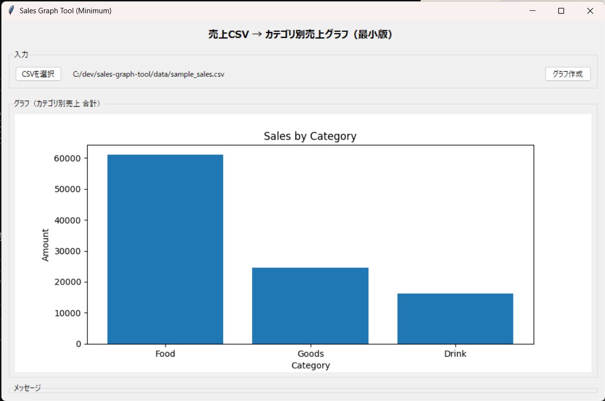
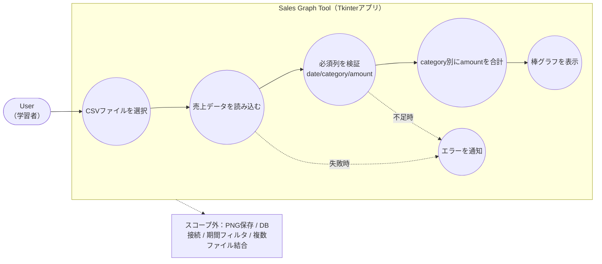
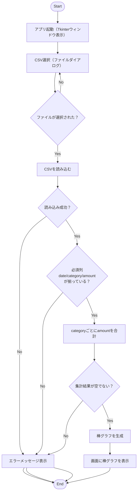
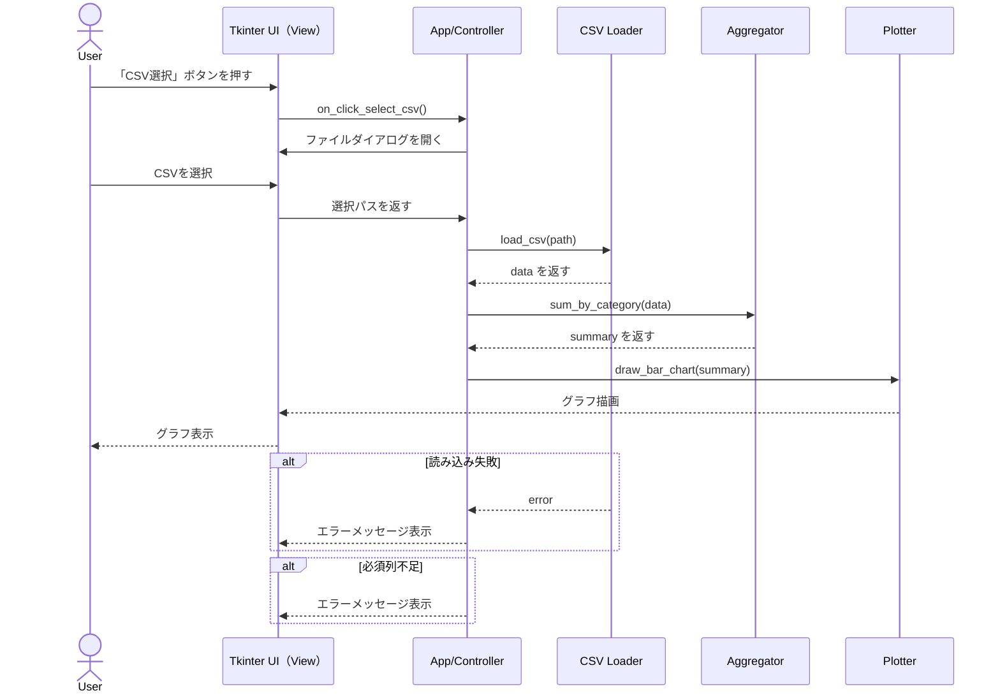

# sales-graph-tool

実行：`python src/app.py`

CSVを選択すると、`category`別に `amount`を合計し、棒グラフで可視化する **最小版ポートフォリオ** です。（目的：未経験→データアナリスト転職に向けた “動く最小成果物” を優先）

- ✅ CSV選択 → 読み込み → 集計 → グラフ表示（Tkinter）
- ❌ PNG保存はスコープ外（次のポートフォリオで対応）

---

## 1. Overview（3行要約）

- CSV（`date, category, amount`）を選ぶだけで、カテゴリ別売上を自動集計します
- 集計結果を棒グラフで表示し、傾向を素早く把握できます
- 最小版として「分析前処理の入口（集計・可視化）」を再現しました

---

## 2. Demo（スクリーンショット）

> サンプルCSV（`data/sample_sales.csv`）を読み込んだ表示例：
> 例：`docs/images/app.png`

例：


---

## 3. Features / Out of Scope（できること / やらないこと）

### ✅ できること

- CSVファイル選択（GUI）
- `category`別に `amount`合計
- 棒グラフを画面表示

### ❌ やらないこと（最小版の方針）

- グラフ画像（PNG）保存
- DB連携（BigQuery等）
- 期間フィルタ（月別/週別）
- 複数ファイル結合
- 高度なデータクレンジング（欠損補完・外れ値処理など）

---

## 4. Input Spec（入力CSV仕様）

### 必須列

- `date`
- `category`
- `amount`

### 任意列

- `quantity` など（最小版では未使用）

### サンプル

- `data/sample_sales.csv`

---

## 5. How to Run（実行手順）

### 5.1 リポジトリ取得

```bash
git clone <your-repo-url>
cd sales-graph-tool
```

### 5.2 仮想環境（.venv）作成・有効化（Windows / cmd）

```bat
python -m venv .venv
.\.venv\Scripts\activate.bat
```

### 5.3 依存インストール

```bash
pip install -r requirements.txt
```

### 5.4 起動

```bash
python src/app.py
```

---

## 6. Diagrams（学習者向け）

### 6.1 Use Case（スコープ確認）



### 6.2 Flowchart（処理の流れ）



### 6.3 Sequence（Optional：イベント駆動の理解用）



---

## 7. Design Decisions（決定事項ログ：最小版の理由）

- 最小で「CSV → 集計 → 可視化」を動かすことを優先
- PNG保存は要求としては有用だが、提出用最小版ではスコープ外にして完成を優先
- 入力CSVの必須列を固定し、扱う前提を明確化（`date/category/amount`）

---

## 8. Future Work（次の一手）

- PNG保存（export）
- 期間フィルタ（月別/週別）
- エラー表示の改善（詳細メッセージ、ログ）
- DB連携（BigQuery等）とダッシュボード化（Looker Studio）
